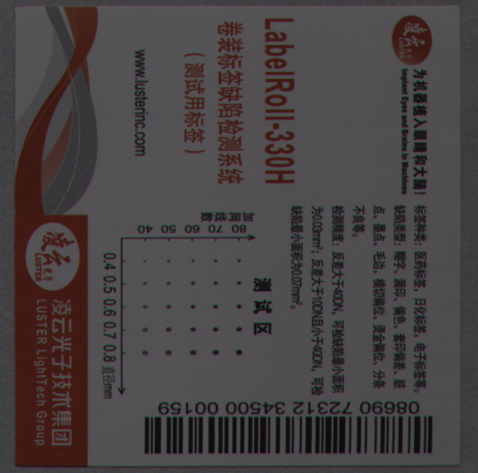
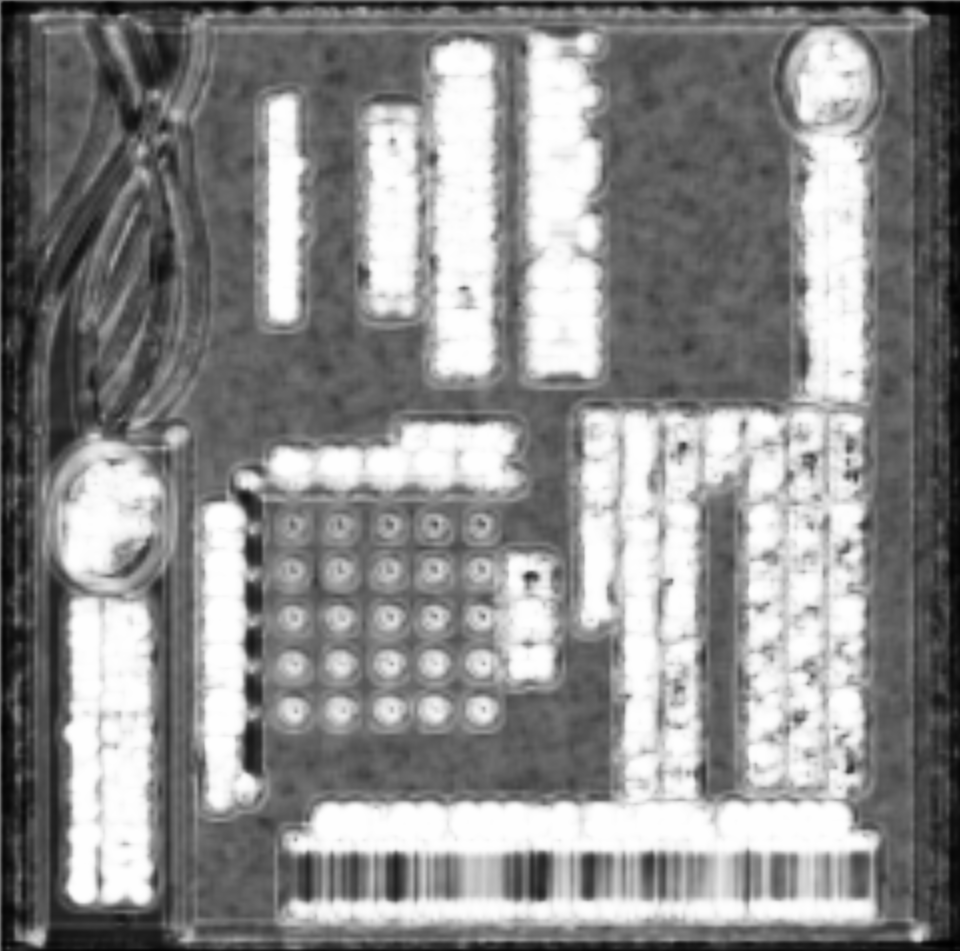
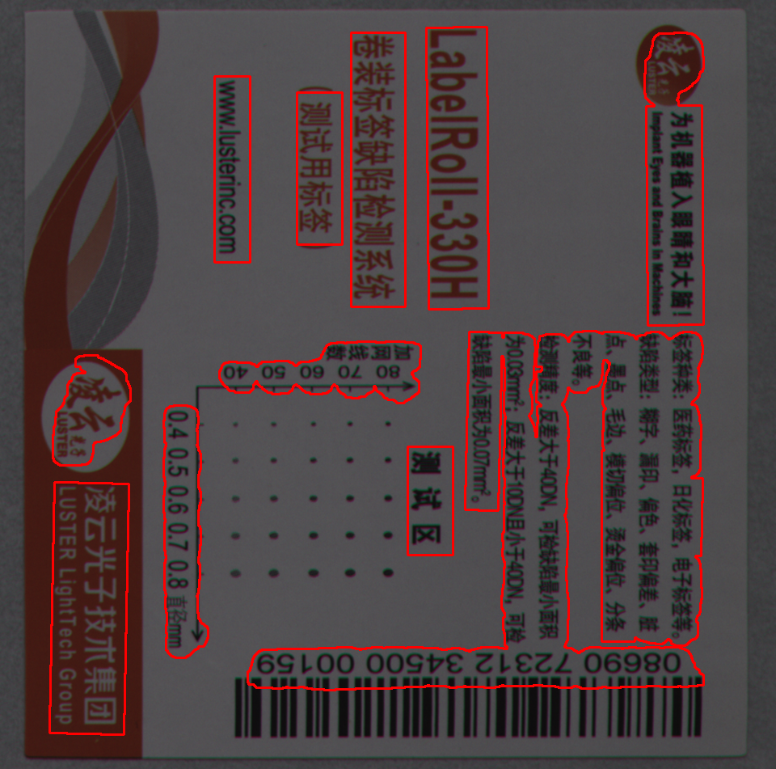

## Multi-language text area segmentation

### Introduction
- Pretrained CNN for area extraction.
- Fine-grained stroke detector.
- Adapted for presswork with large scale and high resolution.

<div style="align: center">

</div>

<div style="align: center">

</div>

<div style="align: center">

</div>

### Demo
Run script, choose image id `$IMG_ID`.
```
sh detect.sh $IMG_ID
```
